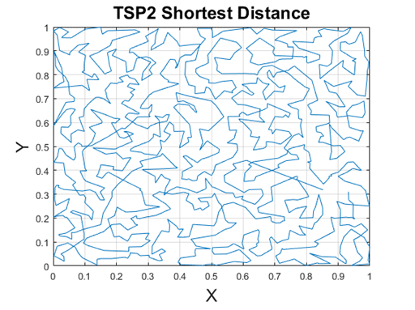

# Traveling Salesman Problem (TSP) 

## Shortest Path

### Array Structure

The original data (TSP2) lists 1000 locations in X and Y axes. After importing this matrix into MATLAB, elements’ sequences are numbered from top to bottom. By altering these sequential numbers and by rearranging the input matrix to follow the new sequence, a new matrix can be achieved as an evolution. The sequential numbers are from 1 to 1000, which can be treated as a gene in Genotype. Following a given gene, a path can be formed by connecting 1000 locations. During an evolution, changing sequential numbers will lead to a different path. The path’s distance will be recalculated and will be utilized as a Phenotype to evaluate the evolution. If the evolution outputs a better result, shorter than previous evolution, the gene will be expected to be kept. Three evolutionary methods: Random Search, Hill Climber, and Genetic Algorithms will be described. Random Search does not keep the evolutionary gene, so it will be used as a baseline to assess others’ performances.  

